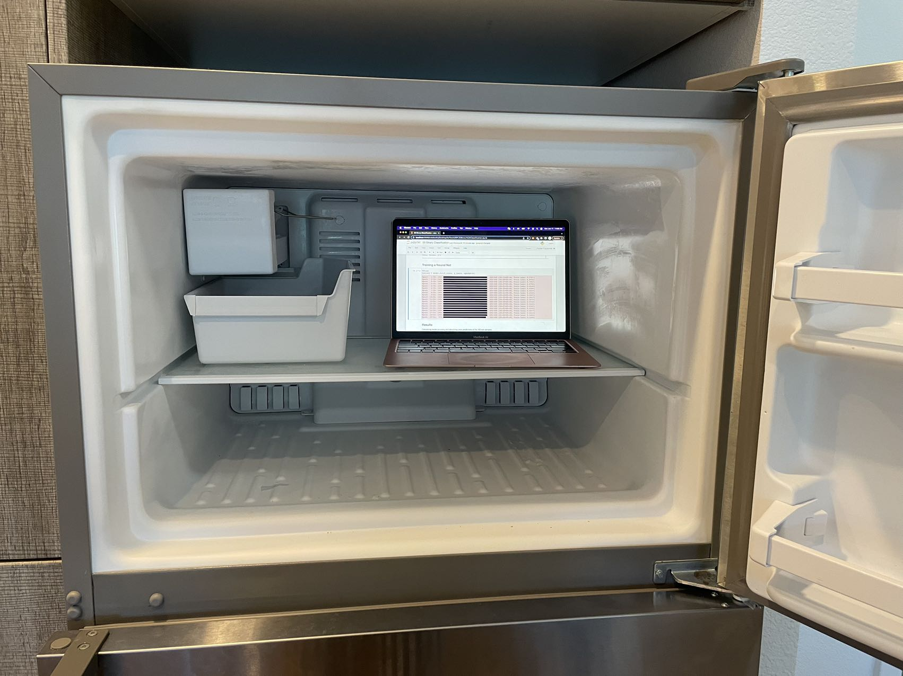

# KaiTorch


KaiTorch is a  deep learning library that dynamically builds a neural network as a **decentralized acyclic graph** (DAG) of `Scalar` values and implements backprop using reverse-mode autodiff. Heavily over-commented, highly impractical, but hopefully educational.

It implements a **Keras-like API** that allows you to build models using a `Sequential` class with Dense and Dropout layers, with implementations of several commonly used weight initializers, activation functions, optimizers, and loss functions.

This project was inspired by and is an extension of Andrej Karpathy's [micrograd](https://github.com/karpathy/micrograd) :)

-----

## Installation

```python
pip install kaitorch
```

-----

## Tutorial Notebooks
0) __Functions and Gradients__
	* [Jupyter Notebook](https://github.com/kaihayden/KaiTorch/blob/main/00%20Functions%20%26%20Gradients.ipynb) // [Google Colab](https://colab.research.google.com/drive/1j1RR7AcRJLFWrwAU7B7enjlTRnaJysbp?usp=sharing)
    * **keywords:** functions, derivatives, gradients
1) __Functions as a Feed Forward Neural Net__
	* [Jupyter Notebook](https://github.com/kaihayden/KaiTorch/blob/main/01%20Functions%20as%20a%20Neural%20Net.ipynb) // [Google Colab](https://colab.research.google.com/drive/1RabrKQ_BvfJU0rW-BYUMmDa8t4eQSTMj?usp=sharing)
    * **keywords:** directed acyclic graph, operator overloading, magic methods, recursion
2) __Reverse-mode Autodiff and Backpropogation__
	* [Jupyter Notebook](https://github.com/kaihayden/KaiTorch/blob/main/02%20Reverse-mode%20Autodiff%20%26%20Backpropogation.ipynb) // [Google Colab](https://colab.research.google.com/drive/1S6ksYWy_yYFTS8UTENh1az8Um79L7reh?usp=sharing)
    * **keywords:** chain rule, reverse-mode autodiff, topological sort, backprop
3) __Activation Functions__
	* [Jupyter Notebook](https://github.com/kaihayden/KaiTorch/blob/main/03%20Activation%20Functions.ipynb) // [Google Colab](https://colab.research.google.com/drive/1EdxjL9aeAguvd88F7E1JaEncUTh02Ntt?usp=sharing)
    * **keywords:** sigmoid, tanh, ReLU, LeakyReLU, ELU, swish
4) __Dense Layer and Weight Initialization__
	* [Jupyter Notebook](https://github.com/kaihayden/KaiTorch/blob/main/04%20Dense%20Layer%20%26%20Weight%20Initialization.ipynb) // [Google Colab](https://colab.research.google.com/drive/1dJd1NnuPF3Ne4fSl0JQ-9avyZ4AKTqh0?usp=sharing)
    * **keywords:** dense layer, multi-layer perceptron, weight initialization, sequential class
5) __Loss Functions__
	* [Jupyter Notebook](https://github.com/kaihayden/KaiTorch/blob/main/05%20Loss%20Functions.ipynb) // [Google Colab](https://colab.research.google.com/drive/1VKJ5KuOSM4B64i9_fB9tMeFt00bsUJaR?usp=sharing)
    * **keywords:** mean squared error, binary crossentropy, categorical crossentropy
6) __Gradient Descent and Optimizers__ (\*personal favorite)
	* [Jupyter Notebook](https://github.com/kaihayden/KaiTorch/blob/main/06%20Gradient%20Descent%20%26%20Optimizers.ipynb) // [Google Colab](https://colab.research.google.com/drive/1j_HVNc829PpaVs40tq01H45SwN2Eku98?usp=sharing)
    * **keywords**: gradient descent, learning rate, momentum, adagrad, rmsprop, adam
7) __Inverted Dropout__
	* [Jupyter Notebook](https://github.com/kaihayden/KaiTorch/blob/main/07%20Dropout%20Layer.ipynb) // [Google Colab](https://colab.research.google.com/drive/1ej7djnLE2VDDnKDKnspZc2EfTTBTUJU-?usp=sharing)
    * **keywords:** dropout layer, inverted dropout, regularization

## Example Notebooks
8) __Regression__
	* [Jupyter Notebook](https://github.com/kaihayden/KaiTorch/blob/main/08%20Regression.ipynb) // [Google Colab](https://colab.research.google.com/drive/1hx8AnRgZ1Cg6MEflZOth8TX8mOUEsutP?usp=sharing)
9) __Binary Classification__
	* [Jupyter Notebook](https://github.com/kaihayden/KaiTorch/blob/main/09%20Binary%20Classification.ipynb) // [Google Colab](https://colab.research.google.com/drive/1Rw8w5cozQMNgcJGTg7rgs8VMYLh5qwWc?usp=sharing)
10) __Multi-class Classification__
	* [Jupyter Notebook](https://github.com/kaihayden/KaiTorch/blob/main/10%20Multiclass%20Classification.ipynb) // [Google Colab](https://colab.research.google.com/drive/1ph0tV6kyUNvvGKPWPoypQFTL2rsMk42d?usp=sharing)

-----

# Keras-esque API
## Building a Neural Net
```python
from kaitorch.models import Sequential
from kaitorch.layers import Dense, Dropout
from kaitorch.losses import CategoricalCrossentropy
from kaitorch.optimizers import Adam
from kaitorch.activations import LeakyReLU
from kaitorch.initializers import LecunNormal

model = Sequential()

model.add(Dense(12, activation='sigmoid', initializer='he_normal'))
model.add(Dropout(0.25))
model.add(Dense(12, activation=LeakyReLU(alpha=0.01), initializer=LecunNormal()))
model.add(Dense(3, activation='softmax'))

model.compile(
    optimizer=Adam(lr=0.025),
    loss=CategoricalCrossentropy()
)
```

## Training a Neural Net
```python
history = model.fit(X_train, y_train, epochs=32)

y_pred = model.predict(X_test)
```

## Tracing/Visualization
```python
model.plot_model(filename='trace')
```


## Cooling Recommended
this is how hot my laptop got training the models in the last 3 notebooks (seriously)  


